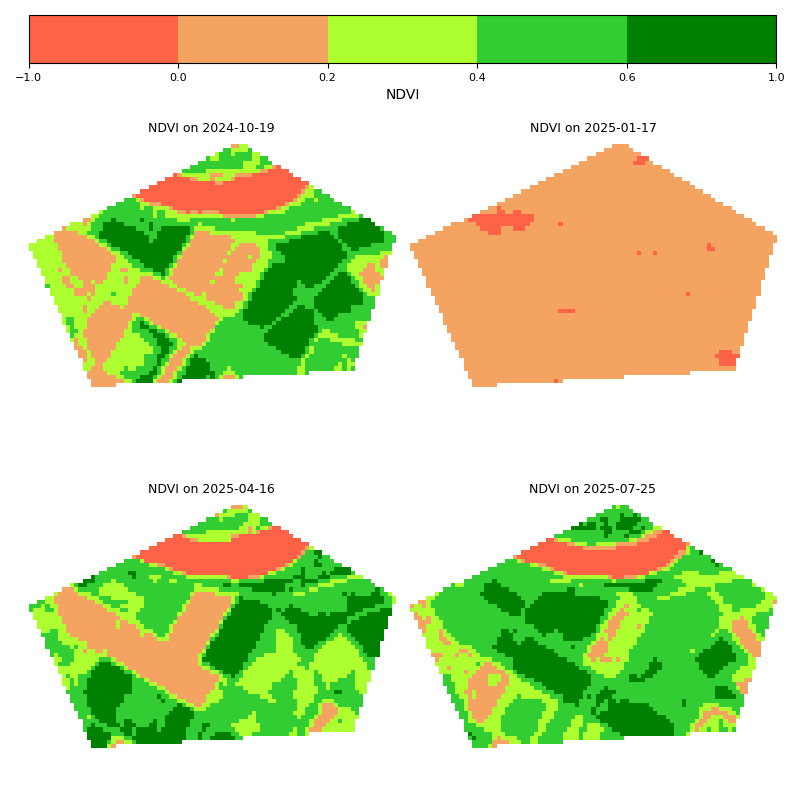

# ndvi_exploration

Coded a python script to explore changes in ndvi from satellite imagery data from Sentinel-2 Copernicus website.

## Coded a python script to explore changes in ndvi from satellite imagery data downloaded from Sentinel-2 Copernicus website.

### How It Works
1. AOI Setup

Just to be sure, I included some lines to check that the AOI (area of interest) is whitin the satellite imagery I downloaded. This involves the AOI  reprojection, but if you are 100% sure that your AOI is included in the bits you downloaded, then these lines are unnecesary

2. Data Loading 

In order to calculate NDVI, you will only need these two bands (red and near infrared). So you would need to look for these in the files downloaded from Copernicus (.SAFE files)

3. Clip to AOI

Unless you want to analyse the whole area covered by the satellite, you will need to clip the the files to obtain just hte bits within your AOI.

4. NDVI Calculation

The NDVI calculation is pretty simple. Do not forget to clip NDVI to [-1, 1]. You can store mean NDVI values or full NDVI arrays depending on what you would like to see.

5. Visualization

I created a line plot of NDVI evolution over time and also a heatmap of NDVI for each date (with shared colorbar).

6. Cloud Coverage

The Copernicus website allows you limit the cloud coverage percentage. As this can modify NDVI measures, it is important to keep it low (<10%)

